# Spring Boot RESTful API — Practical Questions

This repository contains my solutions for “Spring Boot RESTful API — Practical Questions” (Modules 1–3). Each question is implemented as its own Spring Boot project focused on REST controllers only, using Spring Web. I verified all endpoints via Postman, and I included testing screenshots under each module folder.

## Contents

- question1-library-api/ — Library Book Management API
- question2-student-api/ — Student Registration API
- question3-restaurant-api/ — Restaurant Menu API
- question4-ecommerce-api/ — E‑Commerce Product API
- question5-task-api/ — Task Management API
- bonus-userprofile-api/ — User Profile API with response wrapper

## Prerequisites

- JDK 21
- Maven Wrapper (included: `mvnw`, `mvnw.cmd`)
- Postman or curl for testing

## How to Run

Run each project independently from its folder:

Windows (PowerShell or CMD):

```
cd question1-library-api\question1-library-api
.\mvnw.cmd spring-boot:run
```

macOS/Linux:

```
cd question1-library-api/question1-library-api
./mvnw spring-boot:run
```

Repeat for each module:

- `question2-student-api/question2-student-api`
- `question3-restaurant-api/question3-restaurant-api`
- `question4-ecommerce-api/question4-ecommerce-api`
- `question5-task-api/question5-task-api`
- `bonus-userprofile-api/bonus-userprofile-api`


This section is included to satisfy the documentation requirement to explain how to run the application.
Default port: 8080 (if you run multiple at once, change `server.port` as needed).

---


- Base path: `/api/books`
- Model: Book(id: Long, title: String, author: String, isbn: String, publicationYear: int)
- Controller key endpoints:
  - GET `/api/books` — list all
  - GET `/api/books/{id}` — get by id
  - GET `/api/books/search?title={title}` — search by title
  - POST `/api/books` — add book
  - DELETE `/api/books/{id}` — delete
- Status codes used: 200, 201, 204, 404

Example with curl:

```
curl http://localhost:8080/api/books
curl http://localhost:8080/api/books/1
curl "http://localhost:8080/api/books/search?title=Clean"
```

Screenshots:

- question1-library-api/Q1TestingScreenshoot/AddedNewBook.png
- question1-library-api/Q1TestingScreenshoot/DeletedBook.png
- question1-library-api/Q1TestingScreenshoot/GetAllBooks.png
- question1-library-api/Q1TestingScreenshoot/getbyid.png
- question1-library-api/Q1TestingScreenshoot/searchBookByTitle.png

Inline samples:

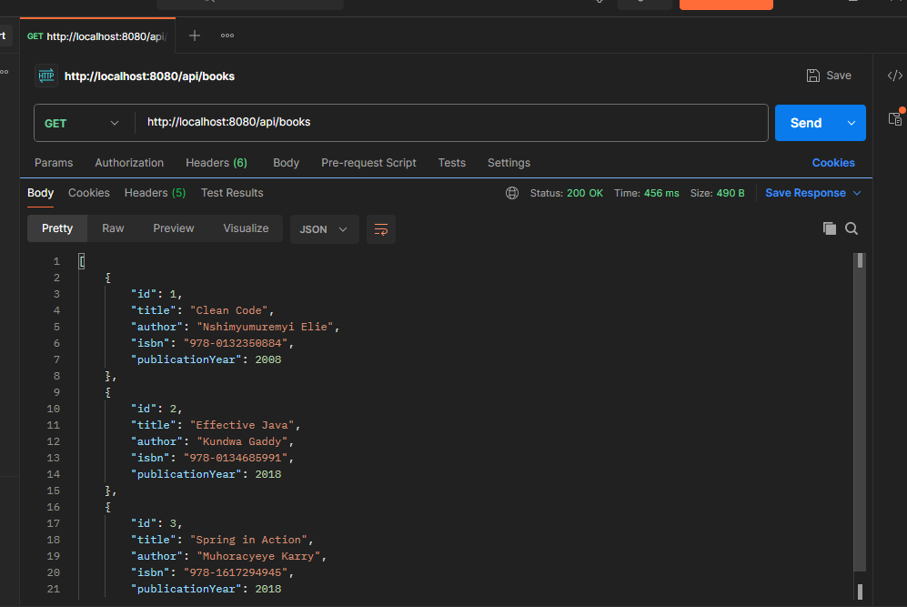
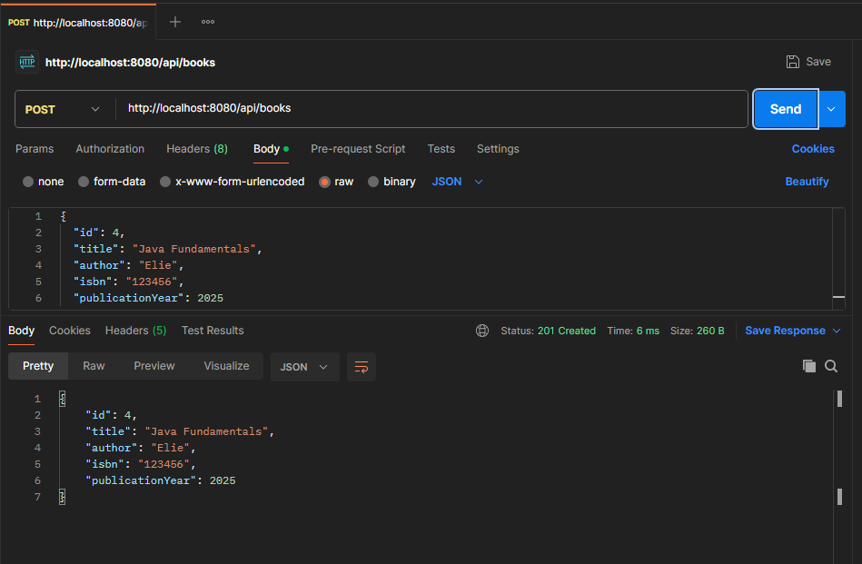

More screenshots are available in: `question1-library-api/Q1TestingScreenshoot/`.

### Sample Requests and Responses

- GET /api/books

```
curl http://localhost:8080/api/books

HTTP/1.1 200 OK
[
  {
    "id": 1,
    "title": "Clean Code",
    "author": "Robert Martin",
    "isbn": "978-0132350884",
    "publicationYear": 2008
  }
]
```

- GET /api/books/{id}

```
curl http://localhost:8080/api/books/1

HTTP/1.1 200 OK
{
  "id": 1,
  "title": "Clean Code",
  "author": "Robert Martin",
  "isbn": "978-0132350884",
  "publicationYear": 2008
}
```

- GET /api/books/search?title=Clean

```
curl "http://localhost:8080/api/books/search?title=Clean"

HTTP/1.1 200 OK
[ { "id": 1, "title": "Clean Code", "author": "Robert Martin", "isbn": "978-0132350884", "publicationYear": 2008 } ]
```

- POST /api/books

```
curl -X POST http://localhost:8080/api/books \
  -H "Content-Type: application/json" \
  -d '{ "id": 4, "title": "Spring in Action", "author": "Craig Walls", "isbn": "978-1617294945", "publicationYear": 2018 }'

HTTP/1.1 201 Created
{ "id": 4, "title": "Spring in Action", "author": "Craig Walls", "isbn": "978-1617294945", "publicationYear": 2018 }
```

- DELETE /api/books/{id}

```
curl -X DELETE http://localhost:8080/api/books/4

HTTP/1.1 204 No Content
```

---

## Question 2: Student Registration API

- Base path: `/api/students`
- Model: Student(studentId: Long, firstName: String, lastName: String, email: String, major: String, gpa: Double)
- Controller key endpoints:
  - GET `/api/students` — list all
  - GET `/api/students/{studentId}` — get by id
  - GET `/api/students/major/{major}` — filter by major (path)
  - GET `/api/students/filter?gpa={minGpa}` — filter by GPA ≥ min
  - POST `/api/students` — register student
  - PUT `/api/students/{studentId}` — update student
- Test scenarios: 5+ sample students, filter by “Computer Science”, GPA ≥ 3.5

Example:

```
curl http://localhost:8080/api/students
curl http://localhost:8080/api/students/1
curl http://localhost:8080/api/students/major/Computer%20Science
curl "http://localhost:8080/api/students/filter?gpa=3.5"
```

Screenshots:

- question2-student-api/Q2TestingScreenshoots/PostStudent.png
- question2-student-api/Q2TestingScreenshoots/getAllStudents.png
- question2-student-api/Q2TestingScreenshoots/getByFilter.png
- question2-student-api/Q2TestingScreenshoots/getByMajor.png
- question2-student-api/Q2TestingScreenshoots/putStudent.png

Inline samples:

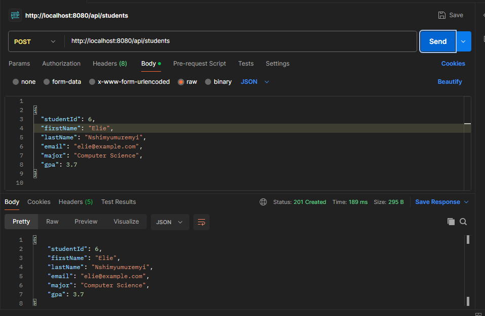
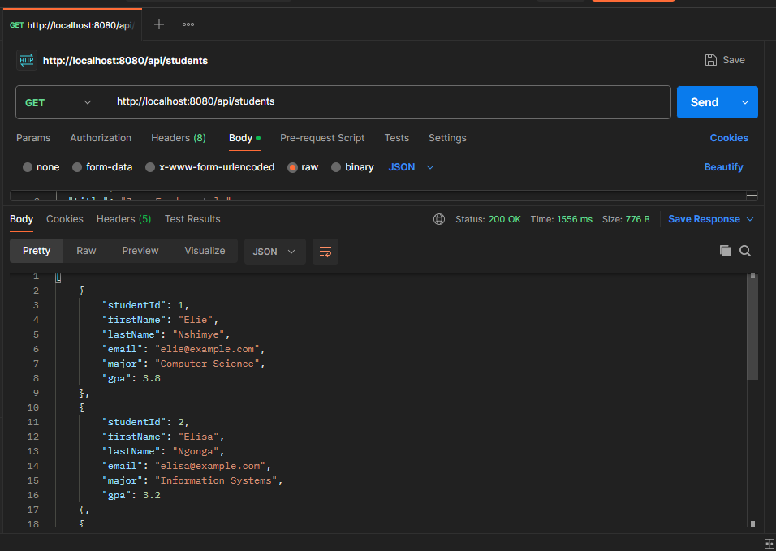

More screenshots are available in: `question2-student-api/Q2TestingScreenshoots/`.

### Sample Requests and Responses

- GET /api/students

```
curl http://localhost:8080/api/students

HTTP/1.1 200 OK
[ { "studentId": 1, "firstName": "Elie", "lastName": "Nshimye", "email": "elie@example.com", "major": "Computer Science", "gpa": 3.8 } ]
```

- GET /api/students/{studentId}

```
curl http://localhost:8080/api/students/1

HTTP/1.1 200 OK
{ "studentId": 1, "firstName": "Elie", "lastName": "Nshimye", "email": "elie@example.com", "major": "Computer Science", "gpa": 3.8 }
```

- GET /api/students/major/{major}

```
curl http://localhost:8080/api/students/major/Computer%20Science

HTTP/1.1 200 OK
[ { "studentId": 1, "firstName": "Elie", "lastName": "Nshimye", "email": "elie@example.com", "major": "Computer Science", "gpa": 3.8 } ]
```

- GET /api/students/filter?gpa=3.5

```
curl "http://localhost:8080/api/students/filter?gpa=3.5"

HTTP/1.1 200 OK
[ { "studentId": 1, "firstName": "Elie", "lastName": "Nshimye", "email": "elie@example.com", "major": "Computer Science", "gpa": 3.8 } ]
```

- POST /api/students

```
curl -X POST http://localhost:8080/api/students \
  -H "Content-Type: application/json" \
  -d '{ "studentId": 6, "firstName": "Aline", "lastName": "Umwali", "email": "aline@example.com", "major": "Networking", "gpa": 3.1 }'

HTTP/1.1 201 Created
{ "studentId": 6, "firstName": "Aline", "lastName": "Umwali", "email": "aline@example.com", "major": "Networking", "gpa": 3.1 }
```

- PUT /api/students/{studentId}

```
curl -X PUT http://localhost:8080/api/students/6 \
  -H "Content-Type: application/json" \
  -d '{ "studentId": 6, "firstName": "Aline", "lastName": "Umwali", "email": "aline@example.com", "major": "Networking", "gpa": 3.3 }'

HTTP/1.1 200 OK
{ "studentId": 6, "firstName": "Aline", "lastName": "Umwali", "email": "aline@example.com", "major": "Networking", "gpa": 3.3 }
```

---

## Question 3: Restaurant Menu API

- Base path: `/api/menu`
- Model: MenuItem(id: Long, name: String, description: String, price: Double, category: String, available: boolean)
- Controller key endpoints:
  - GET `/api/menu` — list all
  - GET `/api/menu/{id}` — get by id
  - GET `/api/menu/category/{category}` — by category
  - GET `/api/menu/available?available=true|false` — by availability
  - GET `/api/menu/search?name={name}` — search by name
  - POST `/api/menu` — add item
  - PUT `/api/menu/{id}/availability` — toggle availability
  - DELETE `/api/menu/{id}` — delete item
- Challenge satisfied: 8+ seeded items across categories

Example:

```
curl "http://localhost:8080/api/menu/available?available=true"
curl "http://localhost:8080/api/menu/category/Dessert"
```

Screenshots:

- question3-restaurant-api/Q3TestingScreenshoots/addedItem.png
- question3-restaurant-api/Q3TestingScreenshoots/deleteItem.png
- question3-restaurant-api/Q3TestingScreenshoots/getAllItems.png
- question3-restaurant-api/Q3TestingScreenshoots/getAvailableItems.png
- question3-restaurant-api/Q3TestingScreenshoots/getByCategory.png
- question3-restaurant-api/Q3TestingScreenshoots/getItemById.png
- question3-restaurant-api/Q3TestingScreenshoots/searchByName.png
- question3-restaurant-api/Q3TestingScreenshoots/toggleAvailable.png

Inline samples:

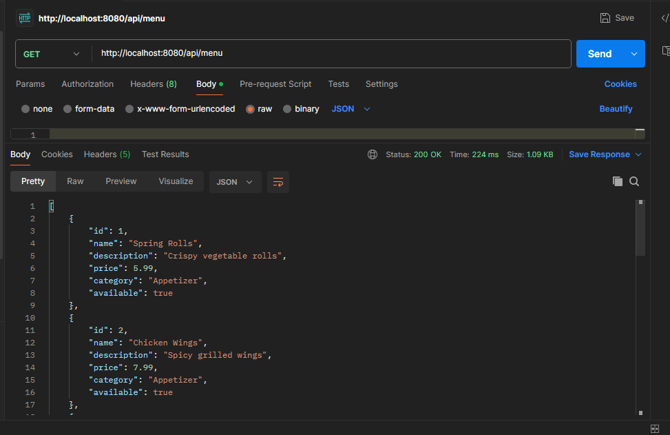
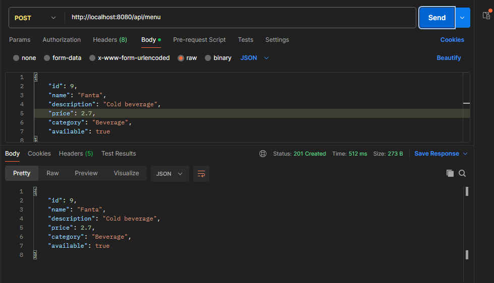

More screenshots are available in: `question3-restaurant-api/Q3TestingScreenshoots/`.

### Sample Requests and Responses

- GET /api/menu

```
curl http://localhost:8080/api/menu

HTTP/1.1 200 OK
[ { "id": 1, "name": "Spring Rolls", "description": "Crispy vegetable rolls", "price": 5.99, "category": "Appetizer", "available": true } ]
```

- GET /api/menu/{id}

```
curl http://localhost:8080/api/menu/1

HTTP/1.1 200 OK
{ "id": 1, "name": "Spring Rolls", "description": "Crispy vegetable rolls", "price": 5.99, "category": "Appetizer", "available": true }
```

- GET /api/menu/category/{category}

```
curl http://localhost:8080/api/menu/category/Dessert

HTTP/1.1 200 OK
[ { "id": 5, "name": "Cheesecake", "description": "Classic dessert", "price": 6.5, "category": "Dessert", "available": true } ]
```

- GET /api/menu/available?available=true

```
curl "http://localhost:8080/api/menu/available?available=true"

HTTP/1.1 200 OK
[ { "id": 1, "name": "Spring Rolls", "available": true, "description": "Crispy vegetable rolls", "price": 5.99, "category": "Appetizer" } ]
```

- GET /api/menu/search?name=cake

```
curl "http://localhost:8080/api/menu/search?name=cake"

HTTP/1.1 200 OK
[ { "id": 6, "name": "Chocolate Cake", "description": "Rich chocolate flavor", "price": 6.0, "category": "Dessert", "available": true } ]
```

- POST /api/menu

```
curl -X POST http://localhost:8080/api/menu \
  -H "Content-Type: application/json" \
  -d '{ "id": 9, "name": "Garlic Bread", "description": "Toasted with butter", "price": 3.50, "category": "Appetizer", "available": true }'

HTTP/1.1 201 Created
{ "id": 9, "name": "Garlic Bread", "description": "Toasted with butter", "price": 3.5, "category": "Appetizer", "available": true }
```

- PUT /api/menu/{id}/availability

```
curl -X PUT http://localhost:8080/api/menu/9/availability

HTTP/1.1 200 OK
{ "id": 9, "name": "Garlic Bread", "description": "Toasted with butter", "price": 3.5, "category": "Appetizer", "available": false }
```

- DELETE /api/menu/{id}

```
curl -X DELETE http://localhost:8080/api/menu/9

HTTP/1.1 204 No Content
```

---

## Question 4: E‑Commerce Product API

- Base path: `/api/products`
- Model: Product(productId: Long, name: String, description: String, price: Double, category: String, stockQuantity: int, brand: String)
- Controller key endpoints:
  - GET `/api/products?page={page}&limit={limit}` — pagination
  - GET `/api/products/{productId}` — details
  - GET `/api/products/category/{category}` — by category
  - GET `/api/products/brand/{brand}` — by brand
  - GET `/api/products/search?keyword={keyword}` — search in name/description
  - GET `/api/products/price-range?min={min}&max={max}` — by price range
  - GET `/api/products/in-stock` — stockQuantity > 0
  - POST `/api/products` — add product
  - PUT `/api/products/{productId}` — update product
  - PATCH `/api/products/{productId}/stock?quantity={quantity}` — update stock
  - DELETE `/api/products/{productId}` — delete product
- Testing: 10+ products across categories, brands, prices

Example:

```
curl "http://localhost:8080/api/products?page=0&limit=5"
curl "http://localhost:8080/api/products/search?keyword=laptop"
curl "http://localhost:8080/api/products/price-range?min=100&max=500"
```

Screenshots:

- question4-ecommerce-api/Q4TestingScreenshoots/addedNewProduct.png
- question4-ecommerce-api/Q4TestingScreenshoots/deletedProduct.png
- question4-ecommerce-api/Q4TestingScreenshoots/getAllproducts.png
- question4-ecommerce-api/Q4TestingScreenshoots/getByBrand.png
- question4-ecommerce-api/Q4TestingScreenshoots/getByCategory.png
- question4-ecommerce-api/Q4TestingScreenshoots/getProductById.png
- question4-ecommerce-api/Q4TestingScreenshoots/getRange.png
- question4-ecommerce-api/Q4TestingScreenshoots/getStock.png
- question4-ecommerce-api/Q4TestingScreenshoots/searchByKeyword.png
- question4-ecommerce-api/Q4TestingScreenshoots/updatedProduct.png
- question4-ecommerce-api/Q4TestingScreenshoots/updatedStockQuantity.png

Inline samples:

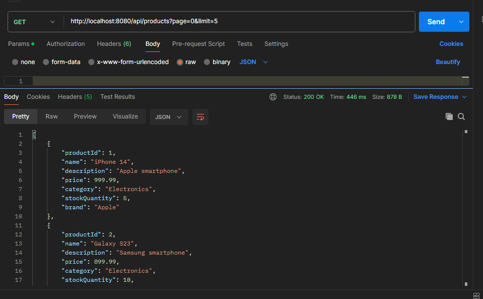
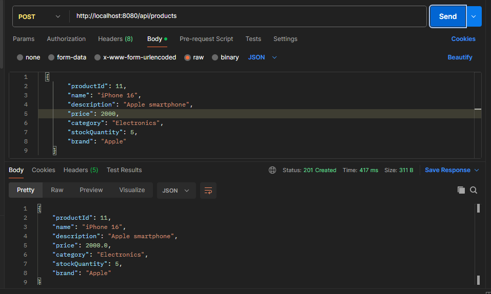

More screenshots are available in: `question4-ecommerce-api/Q4TestingScreenshoots/`.

### Sample Requests and Responses

- GET /api/products?page=0&limit=5

```
curl "http://localhost:8080/api/products?page=0&limit=5"

HTTP/1.1 200 OK
[ { "productId": 1, "name": "iPhone 14", "description": "Apple smartphone", "price": 999.99, "category": "Electronics", "stockQuantity": 5, "brand": "Apple" } ]
```

- GET /api/products/{productId}

```
curl http://localhost:8080/api/products/1

HTTP/1.1 200 OK
{ "productId": 1, "name": "iPhone 14", "description": "Apple smartphone", "price": 999.99, "category": "Electronics", "stockQuantity": 5, "brand": "Apple" }
```

- GET /api/products/category/{category}

```
curl http://localhost:8080/api/products/category/Computers

HTTP/1.1 200 OK
[ { "productId": 3, "name": "MacBook Pro", "description": "Apple laptop", "price": 1999.99, "category": "Computers", "stockQuantity": 3, "brand": "Apple" } ]
```

- GET /api/products/brand/{brand}

```
curl http://localhost:8080/api/products/brand/Apple

HTTP/1.1 200 OK
[ { "productId": 1, "name": "iPhone 14", "brand": "Apple", "category": "Electronics", "price": 999.99, "stockQuantity": 5, "description": "Apple smartphone" } ]
```

- GET /api/products/search?keyword=laptop

```
curl "http://localhost:8080/api/products/search?keyword=laptop"

HTTP/1.1 200 OK
[ { "productId": 3, "name": "MacBook Pro", "description": "Apple laptop", "price": 1999.99, "category": "Computers", "stockQuantity": 3, "brand": "Apple" } ]
```

- GET /api/products/price-range?min=100&max=500

```
curl "http://localhost:8080/api/products/price-range?min=100&max=500"

HTTP/1.1 200 OK
[ { "productId": 5, "name": "Sony Headphones", "price": 199.99, "category": "Accessories", "stockQuantity": 15, "brand": "Sony", "description": "Noise-canceling" } ]
```

- GET /api/products/in-stock

```
curl http://localhost:8080/api/products/in-stock

HTTP/1.1 200 OK
[ { "productId": 1, "name": "iPhone 14", "stockQuantity": 5, "category": "Electronics", "brand": "Apple", "price": 999.99, "description": "Apple smartphone" } ]
```

- POST /api/products

```
curl -X POST http://localhost:8080/api/products \
  -H "Content-Type: application/json" \
  -d '{ "productId": 11, "name": "HP Envy 13", "description": "Ultra portable", "price": 1299.99, "category": "Computers", "stockQuantity": 6, "brand": "HP" }'

HTTP/1.1 201 Created
{ "productId": 11, "name": "HP Envy 13", "description": "Ultra portable", "price": 1299.99, "category": "Computers", "stockQuantity": 6, "brand": "HP" }
```

- PUT /api/products/{productId}

```
curl -X PUT http://localhost:8080/api/products/11 \
  -H "Content-Type: application/json" \
  -d '{ "productId": 11, "name": "HP Envy 13", "description": "Updated desc", "price": 1199.99, "category": "Computers", "stockQuantity": 8, "brand": "HP" }'

HTTP/1.1 200 OK
{ "productId": 11, "name": "HP Envy 13", "description": "Updated desc", "price": 1199.99, "category": "Computers", "stockQuantity": 8, "brand": "HP" }
```

- PATCH /api/products/{productId}/stock?quantity=10

```
curl -X PATCH "http://localhost:8080/api/products/11/stock?quantity=10"

HTTP/1.1 200 OK
{ "productId": 11, "name": "HP Envy 13", "stockQuantity": 10, "description": "Updated desc", "price": 1199.99, "category": "Computers", "brand": "HP" }
```

- DELETE /api/products/{productId}

```
curl -X DELETE http://localhost:8080/api/products/11

HTTP/1.1 204 No Content
```

---

## Question 5: Task Management API

- Base path: `/api/tasks`
- Model: Task(taskId: Long, title: String, description: String, completed: boolean, priority: "LOW|MEDIUM|HIGH", dueDate: "YYYY-MM-DD")
- Controller key endpoints:
  - GET `/api/tasks` — list all
  - GET `/api/tasks/{taskId}` — get by id
  - GET `/api/tasks/status?completed={true|false}` — by completion status
  - GET `/api/tasks/priority/{priority}` — by priority
  - POST `/api/tasks` — create task
  - PUT `/api/tasks/{taskId}` — update task
  - PATCH `/api/tasks/{taskId}/complete` — mark completed
  - DELETE `/api/tasks/{taskId}` — delete

Example:

```
curl "http://localhost:8080/api/tasks/status?completed=false"
curl "http://localhost:8080/api/tasks/priority/HIGH"
```

Screenshots:

- question5-task-api/Q5TestingScreenshoots/getAllTasks.png
- question5-task-api/Q5TestingScreenshoots/getTaskById.png
- question5-task-api/Q5TestingScreenshoots/getTaskByPriority.png
- question5-task-api/Q5TestingScreenshoots/getTasksByCompletionStatus.png
- question5-task-api/Q5TestingScreenshoots/taskAdded.png
- question5-task-api/Q5TestingScreenshoots/updatedTask.png
- question5-task-api/Q5TestingScreenshoots/MarkedTaskCompleted.png
- question5-task-api/Q5TestingScreenshoots/deleteTask.png

Inline samples:

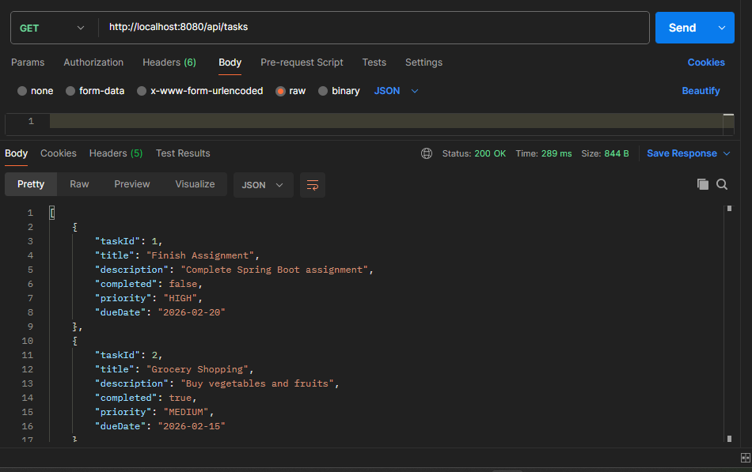
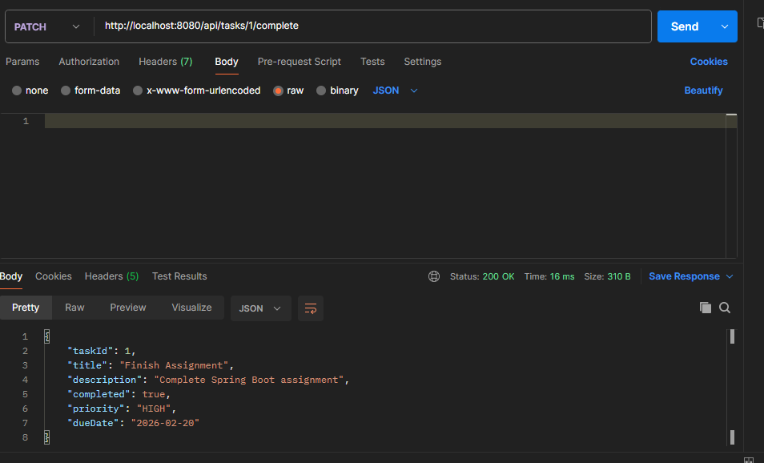

More screenshots are available in: `question5-task-api/Q5TestingScreenshoots/`.

### Sample Requests and Responses

- GET /api/tasks

```
curl http://localhost:8080/api/tasks

HTTP/1.1 200 OK
[ { "taskId": 1, "title": "Finish Assignment", "description": "Complete Spring Boot assignment", "completed": false, "priority": "HIGH", "dueDate": "2026-02-20" } ]
```

- GET /api/tasks/{taskId}

```
curl http://localhost:8080/api/tasks/1

HTTP/1.1 200 OK
{ "taskId": 1, "title": "Finish Assignment", "description": "Complete Spring Boot assignment", "completed": false, "priority": "HIGH", "dueDate": "2026-02-20" }
```

- GET /api/tasks/status?completed=false

```
curl "http://localhost:8080/api/tasks/status?completed=false"

HTTP/1.1 200 OK
[ { "taskId": 1, "title": "Finish Assignment", "completed": false, "description": "Complete Spring Boot assignment", "priority": "HIGH", "dueDate": "2026-02-20" } ]
```

- GET /api/tasks/priority/HIGH

```
curl http://localhost:8080/api/tasks/priority/HIGH

HTTP/1.1 200 OK
[ { "taskId": 1, "title": "Finish Assignment", "description": "Complete Spring Boot assignment", "completed": false, "priority": "HIGH", "dueDate": "2026-02-20" } ]
```

- POST /api/tasks

```
curl -X POST http://localhost:8080/api/tasks \
  -H "Content-Type: application/json" \
  -d '{ "taskId": 6, "title": "Prepare Slides", "description": "For presentation", "completed": false, "priority": "MEDIUM", "dueDate": "2026-02-22" }'

HTTP/1.1 201 Created
{ "taskId": 6, "title": "Prepare Slides", "description": "For presentation", "completed": false, "priority": "MEDIUM", "dueDate": "2026-02-22" }
```

- PUT /api/tasks/{taskId}

```
curl -X PUT http://localhost:8080/api/tasks/6 \
  -H "Content-Type: application/json" \
  -d '{ "taskId": 6, "title": "Prepare Slides", "description": "Updated", "completed": true, "priority": "MEDIUM", "dueDate": "2026-02-22" }'

HTTP/1.1 200 OK
{ "taskId": 6, "title": "Prepare Slides", "description": "Updated", "completed": true, "priority": "MEDIUM", "dueDate": "2026-02-22" }
```

- PATCH /api/tasks/{taskId}/complete

```
curl -X PATCH http://localhost:8080/api/tasks/6/complete

HTTP/1.1 200 OK
{ "taskId": 6, "title": "Prepare Slides", "description": "Updated", "completed": true, "priority": "MEDIUM", "dueDate": "2026-02-22" }
```

- DELETE /api/tasks/{taskId}

```
curl -X DELETE http://localhost:8080/api/tasks/6

HTTP/1.1 204 No Content
```

---

## Bonus: User Profile API (with Response Wrapper)

- Base path: `/api/userprofiles`
- Model: UserProfile(userId: Long, username: String, email: String, fullName: String, age: int, country: String, bio: String, active: boolean)
- Response wrapper: `ApiResponse<T>` with fields `success`, `message`, `data`
- Controller key endpoints:
  - GET `/api/userprofiles` — list all
  - GET `/api/userprofiles/{userId}` — get by id
  - POST `/api/userprofiles` — create
  - PUT `/api/userprofiles/{userId}` — update
  - DELETE `/api/userprofiles/{userId}` — delete
  - PATCH `/api/userprofiles/{userId}/toggle` — activate/deactivate
  - GET `/api/userprofiles/search/username?username={username}` — search username
  - GET `/api/userprofiles/search/country?country={country}` — search country
  - GET `/api/userprofiles/search/age?min={min}&max={max}` — search age range

Example:

```
curl http://localhost:8080/api/userprofiles
curl "http://localhost:8080/api/userprofiles/search/username?username=elie"
```

Screenshots:

- bonus-userprofile-api/bonusQuestionTestingScreenshoots/addedNewUser.png
- bonus-userprofile-api/bonusQuestionTestingScreenshoots/getAllUsers.png
- bonus-userprofile-api/bonusQuestionTestingScreenshoots/getUserById.png
- bonus-userprofile-api/bonusQuestionTestingScreenshoots/searchAgeByRange.png
- bonus-userprofile-api/bonusQuestionTestingScreenshoots/searchByCountry.png
- bonus-userprofile-api/bonusQuestionTestingScreenshoots/searchUser.png
- bonus-userprofile-api/bonusQuestionTestingScreenshoots/userDeactivated.png
- bonus-userprofile-api/bonusQuestionTestingScreenshoots/userProfileDeleted.png
- bonus-userprofile-api/bonusQuestionTestingScreenshoots/userUpdated.png

Inline samples:

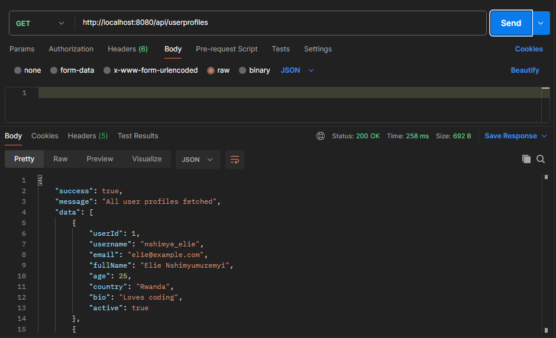
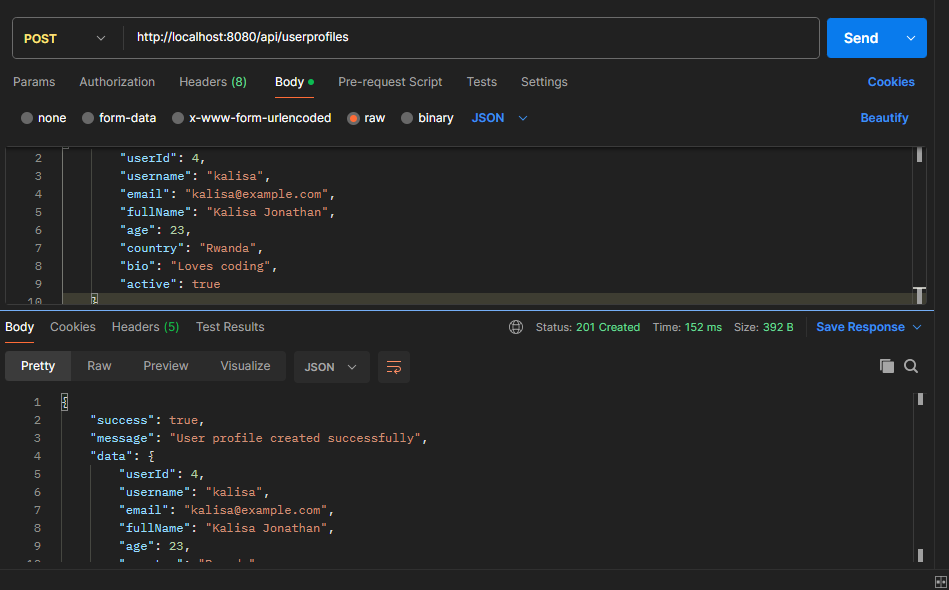

More screenshots are available in: `bonus-userprofile-api/bonusQuestionTestingScreenshoots/`.

### Sample Requests and Responses

- GET /api/userprofiles

```
curl http://localhost:8080/api/userprofiles

HTTP/1.1 200 OK
{ "success": true, "message": "All user profiles fetched", "data": [ { "userId": 1, "username": "nshimye_elie", "email": "elie@example.com", "fullName": "Elie Nshimyumuremyi", "age": 25, "country": "Rwanda", "bio": "Loves coding", "active": true } ] }
```

- GET /api/userprofiles/{userId}

```
curl http://localhost:8080/api/userprofiles/1

HTTP/1.1 200 OK
{ "success": true, "message": "User profile fetched", "data": { "userId": 1, "username": "nshimye_elie", "email": "elie@example.com", "fullName": "Elie Nshimyumuremyi", "age": 25, "country": "Rwanda", "bio": "Loves coding", "active": true } }
```

- POST /api/userprofiles

```
curl -X POST http://localhost:8080/api/userprofiles \
  -H "Content-Type: application/json" \
  -d '{ "userId": 4, "username": "jdoe", "email": "jdoe@example.com", "fullName": "John Doe", "age": 22, "country": "UG", "bio": "New user", "active": true }'

HTTP/1.1 201 Created
{ "success": true, "message": "User profile created successfully", "data": { "userId": 4, "username": "jdoe", "email": "jdoe@example.com", "fullName": "John Doe", "age": 22, "country": "UG", "bio": "New user", "active": true } }
```

- PUT /api/userprofiles/{userId}

```
curl -X PUT http://localhost:8080/api/userprofiles/4 \
  -H "Content-Type: application/json" \
  -d '{ "userId": 4, "username": "john_doe", "email": "john.doe@example.com", "fullName": "John Doe", "age": 23, "country": "UG", "bio": "Updated bio", "active": true }'

HTTP/1.1 200 OK
{ "success": true, "message": "User profile updated", "data": { "userId": 4, "username": "john_doe", "email": "john.doe@example.com", "fullName": "John Doe", "age": 23, "country": "UG", "bio": "Updated bio", "active": true } }
```

- DELETE /api/userprofiles/{userId}

```
curl -X DELETE http://localhost:8080/api/userprofiles/4

HTTP/1.1 200 OK
{ "success": true, "message": "User profile deleted", "data": null }
```

- PATCH /api/userprofiles/{userId}/toggle

```
curl -X PATCH http://localhost:8080/api/userprofiles/1/toggle

HTTP/1.1 200 OK
{ "success": true, "message": "User activated", "data": { "userId": 1, "username": "nshimye_elie", "active": true, "email": "elie@example.com", "fullName": "Elie Nshimyumuremyi", "age": 25, "country": "Rwanda", "bio": "Loves coding" } }
```

- GET /api/userprofiles/search/username?username=elie

```
curl "http://localhost:8080/api/userprofiles/search/username?username=elie"

HTTP/1.1 200 OK
{ "success": true, "message": "Search results", "data": [ { "userId": 1, "username": "nshimye_elie" } ] }
```

- GET /api/userprofiles/search/country?country=Rwanda

```
curl "http://localhost:8080/api/userprofiles/search/country?country=Rwanda"

HTTP/1.1 200 OK
{ "success": true, "message": "Search results", "data": [ { "userId": 1, "country": "Rwanda" } ] }
```

- GET /api/userprofiles/search/age?min=20&max=30

```
curl "http://localhost:8080/api/userprofiles/search/age?min=20&max=30"

HTTP/1.1 200 OK
{ "success": true, "message": "Search results", "data": [ { "userId": 1, "age": 25 } ] }
```

---

## Notes

- All modules are intentionally controller-only to align with the assignment (no service/repository layers).
- HTTP status codes are used appropriately across create/update/delete and not-found scenarios.
- Seeded in-memory lists provide sample data for quick testing without a database.

---

## Folder Map

```
question1-library-api/
  └─ Q1TestingScreenshoot/...
question2-student-api/
  └─ Q2TestingScreenshoots/...
question3-restaurant-api/
  └─ Q3TestingScreenshoots/...
question4-ecommerce-api/
  └─ Q4TestingScreenshoots/...
question5-task-api/
  └─ Q5TestingScreenshoots/...
bonus-userprofile-api/
  └─ bonusQuestionTestingScreenshoots/...
```

